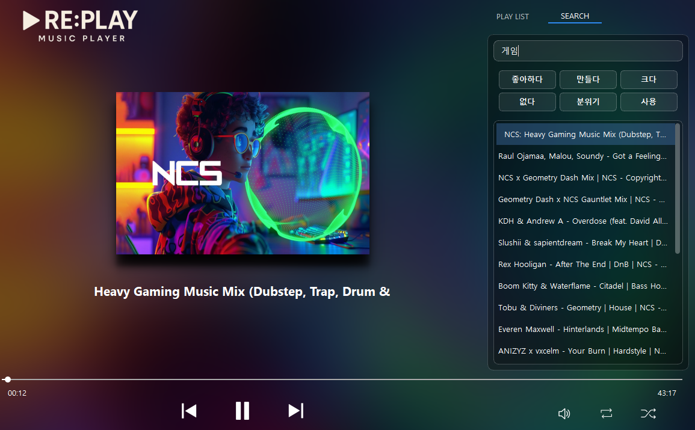

# 🎵 RE:PLAY - NCS Music Recommender

<div align="center">
<table>
<tr>
<td></td>
</tr>
<td></td>
</table>
</div>

<div align="center">
  
  
  
  
</div>

## 📌 프로젝트 소개

**RE:PLAY**는 YouTube NCS(NoCopyrightSounds) 채널의 음악 댓글 데이터를 분석하여 키워드 기반 음악 추천을 제공하는 뮤직 플레이어입니다. 자연어 처리(NLP) 기술을 활용하여 사용자가 원하는 분위기나 용도에 맞는 BGM을 쉽게 찾을 수 있도록 도와줍니다.

## ✨ 주요 기능

### 🎯 핵심 기능
- **키워드 기반 음악 추천**: Word2Vec과 TF-IDF를 활용한 지능형 추천 시스템
- **제목 검색**: 음악 제목으로 직접 검색 가능

- **분위기 검색**: '잔잔한', '에너지', '몽환적인' 등 감성 키워드로 검색

- **YouTube 스트리밍**: VLC를 통한 실시간 YouTube 음악 재생
- **재생목록 관리**: 자동 저장 및 불러오기 기능

### 🎨 UI 특징
- 유튜브 썸네일 기반 동적 배경
- 블러 효과를 활용한 몰입감 있는 인터페이스
- 다크 모드 글래스모피즘 디자인
- 실시간 재생 정보 표시

## 🛠️ 기술 스택

### Backend
- **Python 3.x**
- **Selenium**: YouTube 댓글 크롤링
- **KoNLPy (Okt)**: 한국어 형태소 분석
- **Deep Translator**: 다국어 댓글 번역

### NLP & ML
- **TF-IDF**: 문서 내 단어 중요도 계산
- **Word2Vec**: 단어 임베딩 및 유사도 분석
- **Gensim**: Word2Vec 모델 학습

### Frontend
- **PyQt5**: GUI 프레임워크
- **Qt Designer**: UI 디자인
- **VLC Python Bindings**: 미디어 재생
- **PIL (Pillow)**: 이미지 처리

### Data Processing
- **Pandas**: 데이터 처리 및 분석
- **NumPy**: 수치 연산
- **SciPy**: 코사인 유사도 계산

## 📁 프로젝트 구조

```
RE:PLAY/
│
├── 📂 Data/                     # 데이터 저장 폴더
│   ├── NCS_Crawling_*.csv       # 크롤링된 원본 데이터
│   ├── sample_preprocessed_data.csv  # 전처리된 데이터
│   └── playlist.pkl             # 저장된 재생목록
│
├── 📂 models/                   # 학습된 모델
│   ├── tfidf.pickle            # TF-IDF 벡터라이저
│   ├── tfidf_music_review.mtx  # TF-IDF 매트릭스
│   └── word2vec_music_review.model  # Word2Vec 모델
│
├── 📂 ui/                       # UI 관련 파일
│   ├── replay.ui               # Qt Designer UI 파일
│   ├── replay.qrc              # 리소스 파일
│   └── img/                    # UI 아이콘 및 이미지
│
├── 📜 Core Files
│   ├── 00_crawling.py          # YouTube 데이터 크롤링
│   ├── 01_Translate.py         # 댓글 번역
│   ├── 02_concat.py            # 데이터 병합
│   ├── 03_preprocess.py        # 데이터 전처리
│   ├── 04_TFIDF.py            # TF-IDF 벡터화
│   ├── 05_word2vec.py         # Word2Vec 학습
│   ├── replay_ui_main.py      # 메인 애플리케이션
│   └── Crawler.py             # 크롤러 클래스
│
└── 📜 stopwords-ko.txt         # 한국어 불용어 목록
```

## 🚀 설치 방법

### 1. 필수 요구사항
- Python 3.8 이상
- Chrome 브라우저 (크롤링용)

### 2. 의존성 설치

```bash
# 가상환경 생성 (권장)
python -m venv venv
source venv/bin/activate  # Windows: venv\Scripts\activate

# 필수 패키지 설치
pip install pandas numpy scipy
pip install selenium webdriver-manager
pip install deep-translator
pip install konlpy
pip install gensim scikit-learn
pip install PyQt5
pip install python-vlc
pip install Pillow
pip install yt-dlp
```

### 3. 추가 설정
- **KoNLPy 설치**: Java 설치 필요 ([설치 가이드](https://konlpy.org/ko/latest/install/))
- **VLC 플레이어**: 시스템에 VLC 설치 필요 ([다운로드](https://www.videolan.org/))

## 📊 데이터 처리 과정

### 1️⃣ 데이터 수집 (`00_crawling.py`)
```python
# NCS YouTube 채널에서 음악 정보 크롤링
python 00_crawling.py
```
- YouTube NCS 채널 접속
- 각 영상의 제목, ID, 댓글 수집
- CSV 파일로 저장

### 2️⃣ 번역 처리 (`01_Translate.py`)
```python
# 외국어 댓글을 한국어로 번역
python 01_Translate.py
```
- Google Translator API 활용
- 배치 처리로 효율적 번역

### 3️⃣ 데이터 전처리 (`03_preprocess.py`)
```python
# 형태소 분석 및 불용어 제거
python 03_preprocess.py
```
- Okt 형태소 분석기 사용
- 명사, 형용사, 동사 추출
- 불용어 제거

### 4️⃣ 벡터화 (`04_TFIDF.py`, `05_word2vec.py`)
```python
# TF-IDF 벡터화
python 04_TFIDF.py

# Word2Vec 모델 학습
python 05_word2vec.py
```

## 🎮 사용 방법

### 애플리케이션 실행
```bash
python replay_ui_main.py
```

### 주요 기능 사용법

1. **음악 검색**
   - 상단 검색창에 제목 또는 키워드 입력
   - 랜덤 추천 버튼으로 빠른 검색

2. **재생 컨트롤**
   - 재생/일시정지: 중앙 재생 버튼
   - 이전곡/다음곡: 좌우 화살표 버튼
   - 볼륨 조절: 볼륨 슬라이더
   - 반복/랜덤 재생: 하단 컨트롤 버튼

3. **재생목록 관리**
   - 검색 결과 더블클릭으로 추가
   - 우클릭으로 목록에서 삭제
   - 프로그램 종료 시 자동 저장

## 🎥 시연영상

### 시나리오
1. search 탭에서 추천 분위기 선택
2. 더블클릭으로 곡 재생 및 playlist 누적
3. 직접 곡 제목 검색 및 분위기 검색 가능

<div align="center">
<a href="https://youtu.be/HKOyJ8LapNY">
  
</a>
</div>
<div align="center">
*클릭하면 데모 영상을 볼 수 있습니다*
</div>


## 👥 팀 구성

| 이름 | 역할 | 담당 업무 |
|------|------|-----------|
| **김경민** | 팀장 | • 데이터 수집 및 웹 크롤링<br>• 전반적인 시스템 코드 구현 |
| **김현빈** | 팀원 | • 데이터 수집 및 웹 크롤링<br>• UI 인터페이스 및 결과 시각화 |
| **조해찬** | 팀원 | • 데이터 수집 및 웹 크롤링<br>• 발표 자료 기획 및 시각 구성 |

## 🔍 추천 알고리즘

### Word2Vec + TF-IDF 하이브리드 방식
1. 사용자 입력 키워드를 Word2Vec으로 유사 단어 추출
2. 유사 단어들에 가중치 부여 (거리 기반)
3. TF-IDF 벡터로 변환
4. 코사인 유사도로 가장 유사한 음악 추천

```python
def get_similar_titles_by_keyword(keyword, topn=20):
    # 1. Word2Vec으로 유사 단어 찾기
    sim_words = word2vec_model.most_similar(keyword, topn=10)
    
    # 2. 가중치 문장 생성
    weighted_sentence = create_weighted_sentence(keyword, sim_words)
    
    # 3. TF-IDF 벡터화
    sent_vec = tfidf_vectorizer.transform([weighted_sentence])
    
    # 4. 코사인 유사도 계산
    cosine_sim = linear_kernel(sent_vec, tfidf_matrix)
    
    return top_similar_songs
```

## 📈 개선 사항

### 현재 한계점
- 크롤링 중 오류 발생 시 데이터 손실
- 고정된 창 크기
- 랜덤 추천 버튼 새로고침 필요

### 향후 계획
- [ ] 실시간 데이터 백업 기능
- [ ] 반응형 UI 구현
- [ ] 동적 키워드 추천 시스템
- [ ] 자연어 문장 검색 지원
- [ ] 플레이리스트 공유 기능
- [ ] 오프라인 캐싱 지원

## 📝 라이선스

이 프로젝트는 교육 목적으로 제작되었습니다. NCS(NoCopyrightSounds)의 음악은 저작권 프리 음악이지만, 사용 시 해당 채널의 라이선스 정책을 확인하시기 바랍니다.

## 🤝 기여하기

프로젝트 개선에 관심이 있으시다면 다음 방법으로 기여할 수 있습니다:

1. Fork the Project
2. Create your Feature Branch (`git checkout -b feature/AmazingFeature`)
3. Commit your Changes (`git commit -m 'Add some AmazingFeature'`)
4. Push to the Branch (`git push origin feature/AmazingFeature`)
5. Open a Pull Request

## 📞 문의사항

프로젝트에 대한 문의사항이 있으시면 Issues 탭을 통해 남겨주세요.

---

<div align="center">
  <strong>🎵 Enjoy Your Music with RE:PLAY 🎵</strong>
</div>
